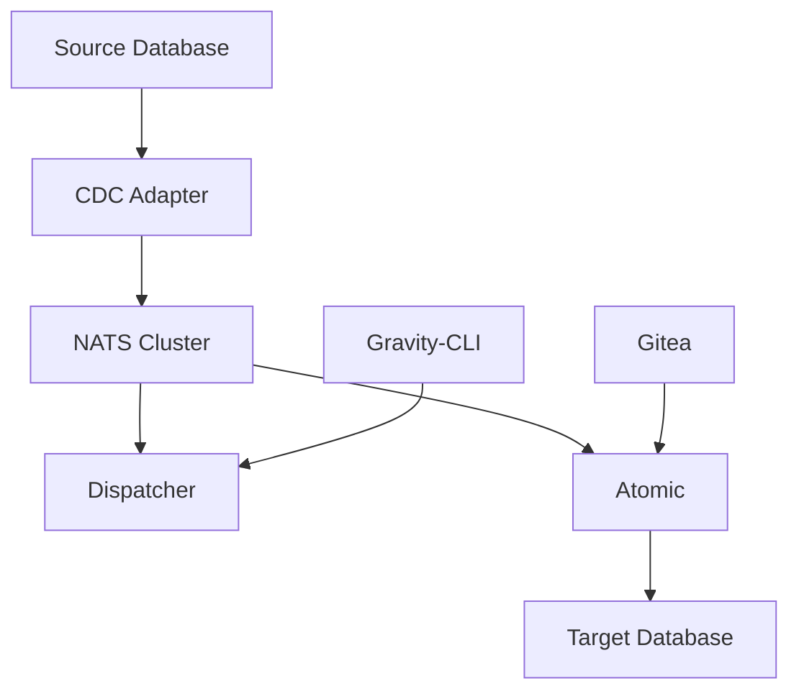

# Gravity 2.0 部署指南

## 📋 目錄

- [產品介紹](#產品介紹)
- [系統架構](#系統架構)
- [部署前準備](#部署前準備)
- [部署流程](#部署流程)
- [Gravity-CLI 使用](#gravity-cli-使用)
- [Atomic 配置](#atomic-配置)
- [測試與驗證](#測試與驗證)
- [故障排除](#故障排除)

## 🚀 產品介紹

Gravity 2.0 是一個分散式即時資料處理平台，基於 Data Product 概念，提供企業級的資料管線解決方案。

### 核心特色
- **即時 CDC 捕獲**：支援多種資料庫的變更資料捕獲
- **Low-Code 處理**：透過 Atomic 提供視覺化資料處理流程
- **分散式架構**：基於 Kubernetes 的高可用性部署
- **Data Mesh 支援**：支援分散式資料網格架構

## 🏗️ 系統架構

### 核心元件



#### 元件說明
- **CDC Adapter**：資料庫變更捕獲器
- **NATS Cluster**：輕量化訊息佇列叢集
- **Dispatcher**：系統管理與 CLI 介面
- **Atomic**：Low-Code 資料處理引擎
- **Gitea**：版本控制與配置管理

## 📋 部署前準備

### 系統需求
- Kubernetes 叢集 (v1.20+)
- kubectl 命令工具
- 預設 Storage Class
- 網路連通性

### 資料庫準備
- **來源端**：MSSQL Server (啟用 CDC) 或 PostgreSQL Server (啟用 WAL)
- **目標端**：MySQL Server
- **版控**：Gitea 服務與 Access Token

### 可用映像版本
- `ghcr.io/brobridgeorg/nats-server:v1.3.25-20250701`
- `ghcr.io/brobridgeorg/gravity-dispatcher:v0.0.31-20250701`
- `ghcr.io/brobridgeorg/atomic/atomic:v0.0.5-20231012-ubi`
- `ghcr.io/brobridgeorg/gravity-adapter-postgres:v2.0.8-20250601`

### 環境變數配置
請更新 `00-lab-configmap.yaml` 中的以下參數：

```yaml
data:
  # MSSQL 來源配置 (選擇使用)
  SOURCE_DATABASE_HOST: "your-mssql-host"
  SOURCE_DB_MSSQL_DB_NAME: "your-database"
  
  # PostgreSQL 來源配置 (選擇使用)
  SOURCE_POSTGRES_HOST: "your-postgres-host"
  SOURCE_POSTGRES_DB_NAME: "your-database"
  
  # 目標資料庫配置
  TARGET_DB_MYSQL_HOST: "your-mysql-host"
  
  # Gitea 配置
  GIT_TOKEN: "your-gitea-token"
  GIT_URL: "your-gitea-url"
```

## 🚀 部署流程

### 方法一：自動化部署
```bash
# 執行自動化部署腳本
./deploy.sh
```

### 方法二：手動部署

#### 步驟 1：建立 Namespace
```bash
kubectl apply -f namespace.yaml
```

#### 步驟 2：配置基本設定
```bash
kubectl apply -f 00-lab-configmap.yaml
kubectl apply -f 01-lab-secret.yaml
```

#### 步驟 3：部署 NATS 叢集
```bash
kubectl apply -f 10-lab-gravity-nats.yaml

# 等待 NATS 就緒
kubectl -n gravity2-lab wait --for=condition=ready pod --selector=app=gravity,component=nats --timeout=300s
```

#### 步驟 4：部署 Dispatcher
```bash
kubectl apply -f 20-lab-gravity-dispatcher.yaml

# 等待 Dispatcher 就緒
kubectl -n gravity2-lab wait --for=condition=ready pod --selector=app=gravity,component=dispatcher --timeout=300s
```

#### 步驟 5：部署 Adapter
選擇適合的資料庫 Adapter：

**MSSQL Adapter：**
```bash
kubectl apply -f 30-lab-adapter-mssql.yaml

# 等待 Adapter 就緒
kubectl -n gravity2-lab wait --for=condition=ready pod --selector=app=gravity-adapter,component=mssql --timeout=300s
```

**PostgreSQL Adapter：**
```bash
kubectl apply -f 30-lab-adapter-postgres.yaml

# 等待 Adapter 就緒
kubectl -n gravity2-lab wait --for=condition=ready pod --selector=app=gravity-adapter,component=postgres --timeout=300s
```

#### 步驟 6：部署 Atomic
```bash
kubectl apply -f 40-lab-atomic.yaml

# 等待 Atomic 就緒
kubectl -n gravity2-lab wait --for=condition=ready pod --selector=app=atomic --timeout=300s
```

### 部署驗證
```bash
# 檢查所有 Pod 狀態
kubectl -n gravity2-lab get pods

# 檢查服務狀態
kubectl -n gravity2-lab get svc

# 檢查 NATS Stream
kubectl -n gravity2-lab exec -t lab-gravity-nats-0 -- /nats str ls
```

## 🔧 Gravity-CLI 使用

### 安裝與連線
```bash
# 設定連線參數
export GRAVITY_HOST="lab-gravity-nats:4222"
export GRAVITY_DOMAIN="default"
```

### 常用命令

#### Data Product 管理
```bash
# 建立 Data Product
gravity-cli product create misrc --desc="misrc dp" --enabled --schema=./schema.json -s $GRAVITY_HOST

# 列出 Data Products
gravity-cli product list -s $GRAVITY_HOST

# 查看 Data Product 資訊
gravity-cli product info misrc -s $GRAVITY_HOST
```

#### 規則集管理
```bash
# 新增規則集
gravity-cli product ruleset add misrc misrcCreate \
  --enabled \
  --event=misrcCreate \
  --method=create \
  --handler=./handler.js \
  --schema=./schema.json \
  -s $GRAVITY_HOST
```

#### Token 管理
```bash
# 建立 Access Token
gravity-cli token create --desc "lab atomic" --enabled true -s $GRAVITY_HOST

# 列出 Tokens
gravity-cli token list -s $GRAVITY_HOST

# 查看 Token 詳情
gravity-cli token info <token-id> -s $GRAVITY_HOST
```

## ⚙️ Atomic 配置

### 存取 Atomic 介面
Atomic 提供 Web 介面進行 Low-Code 資料處理流程設計：

```
http://<your-k8s-node>:32300
```

### 基本流程設計

#### 1. 資料訂閱
- 建立 Subscriber 節點
- 設定 Data Product 訂閱
- 配置 Access Token

#### 2. 資料處理
- 事件分類處理
- 資料轉換邏輯
- 欄位對應設定

#### 3. 資料輸出
- MySQL 模組配置
- 資料庫連線設定
- 寫入規則定義

### 模組安裝
在 Atomic 介面中安裝必要模組：
```javascript
// MySQL 模組安裝
npm install node-red-contrib-mysql
```

## 🧪 測試與驗證

### 資料流測試

#### 1. 新增資料測試
```sql
-- 在來源 MSSQL 執行
INSERT INTO mi_source (id, name, value) VALUES (1, 'test', 'data');
```

#### 2. 更新資料測試
```sql
-- 在來源 MSSQL 執行
UPDATE mi_source SET value = 'updated' WHERE id = 1;
```

#### 3. 刪除資料測試
```sql
-- 在來源 MSSQL 執行
DELETE FROM mi_source WHERE id = 1;
```

### 監控與除錯

#### 查看 Pod 日誌
```bash
# Adapter 日誌
kubectl -n gravity2-lab logs lab-adapter-mssql-0

# Atomic 日誌
kubectl -n gravity2-lab logs <atomic-pod-name>

# Dispatcher 日誌
kubectl -n gravity2-lab logs lab-gravity-dispatcher-0
```

#### NATS 監控
```bash
# 檢查 NATS 連線
kubectl -n gravity2-lab exec -t lab-gravity-nats-0 -- /nats server check connection

# 查看 Stream 資訊
kubectl -n gravity2-lab exec -t lab-gravity-nats-0 -- /nats str info GVT_default_DP_misrc
```

## 🛠️ 故障排除

### 常見問題

#### 1. Pod 無法啟動
```bash
# 檢查事件
kubectl -n gravity2-lab describe pod <pod-name>

# 檢查資源限制
kubectl -n gravity2-lab top pods
```

#### 2. 資料庫連線失敗
- 檢查 ConfigMap 中的連線參數
- 驗證 Secret 中的密碼正確性
- 確認網路連通性

#### 3. NATS 叢集問題
```bash
# 檢查 NATS 叢集狀態
kubectl -n gravity2-lab exec -t lab-gravity-nats-0 -- /nats server list

# 重新啟動 NATS
kubectl -n gravity2-lab delete pod lab-gravity-nats-0
```

#### 4. Atomic 流程錯誤
- 檢查 Gitea 連線與 Token
- 驗證模組安裝狀態
- 查看流程設計邏輯

### 錯誤處理機制

#### 修改 Acknowledge 方式
在 Atomic 中設定適當的錯誤處理：
- 自動重試機制
- 錯誤訊息記錄
- 死信佇列處理

## 📚 其他資源

### 官方文件
- [Gravity 官方文件](https://docs.gravity.com)
- [NATS 文件](https://docs.nats.io)
- [Kubernetes 文件](https://kubernetes.io/docs)

### 影片教學
- Gravity_2.0_標準教育訓練_part-1.mp4
- Gravity_2.0_標準教育訓練_part-2.mp4  
- Gravity_2.0_標準教育訓練_part-3.mp4

---

## 📝 版本資訊
- **版本**：v1.3
- **更新日期**：2024-09-13
- **負責人**：Kenny Chen

## 📞 技術支援
如遇到問題，請聯繫技術支援團隊或參考官方文件。